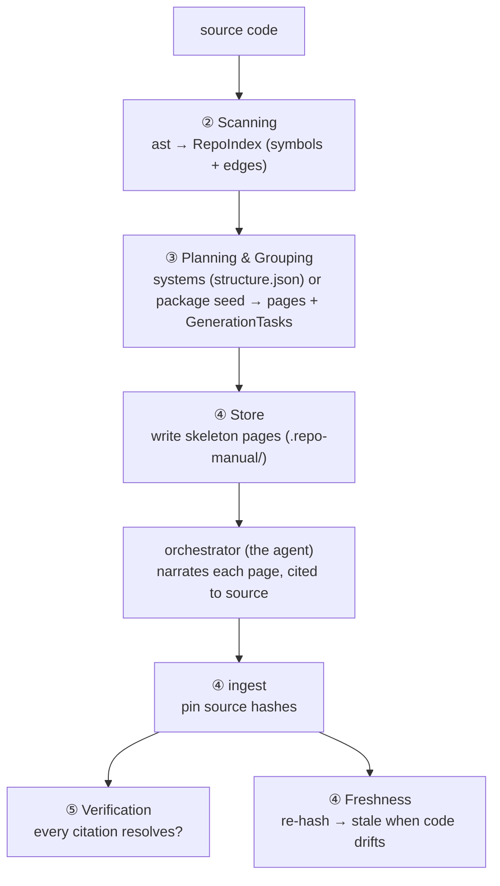
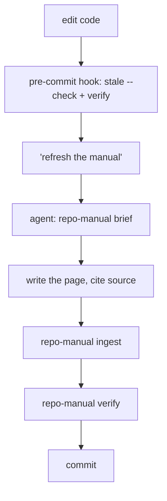

<!-- repo-manual:generated:start -->
# Overview — start here

`repo-manual` produces the very thing you're reading: a **committed, version-controlled orientation
manual that an AI writes and a human reads.** It scans a codebase into a structural index, groups the
files into *systems*, writes one Markdown page per system, and tracks freshness so the manual flags
itself when the code drifts out from under it.

The defining design choice: **there is no bundled LLM.** The agent running the tool *is* the narrator —
it reads each page's brief, writes the prose, and the tool pins the result to its source. (This manual
was written exactly that way.)

## The pipeline

Every box is driven from **⑥ CLI**: `scan` · `structure` · `generate` · `plan` · `brief` · `ingest` ·
`stale` · `verify` · `hook` · `serve`. `Sources: [src/repo_manual/cli.py:62-348]()`

## Systems map

Seven systems, read in dependency order (① is the leaf vocabulary, ⑥ is the root that wires it together):

| # | System | In one line | Read first if… |
|---|---|---|---|
| **①** | [Data Model & Config](../systems/data-model.md) | the IR + manual structure + `GenerationTask` — the vocabulary | you want the types everything else uses |
| **②** | [Scanning](../systems/scanning.md) | `ast` → a `RepoIndex` of symbols + edges (the grounding) | you're adding a language or improving the graph |
| **③** | [Planning & Grouping](../systems/planning.md) | carve the index into pages (AI systems or package seed) + briefs | you're changing how files become pages |
| **④** | [Store & Freshness](../systems/store-freshness.md) | write/merge `.repo-manual/` + drift detection — **the wedge** | **you're touching how pages persist — start here** |
| **⑤** | [Verification](../systems/verification.md) | the citation trust gate (no LLM) | you're hardening trust |
| **⑥** | [CLI](../systems/cli.md) | the commands that wire it all into the workflow | you're changing flags or the loop |
| **⑦** | [Viewer](../systems/viewer.md) | a no-build browser view: nav, rendered pages, drill-down, graph | you want to browse it (`repo-manual serve`) |

## The loop a user actually runs

Each step is local and needs no key; the deterministic gate (`stale --check` + `verify`) holds the line
even when no agent is around. `Sources: [src/repo_manual/store.py:109-134]()` Browse the result with
`repo-manual serve` — the [⑦ Viewer](../systems/viewer.md) adds a system sidebar, rendered pages, function
drill-down, and an interactive import/call graph.

## The one stance to absorb

**The tool never invents and never silently rots.** The scanner records only what it can resolve (calls
it can't pin down are dropped, not guessed); the narrator is told to cite every claim; `verify` checks
those citations are real; and freshness marks a page **stale** the moment its source changes. The manual
is held to the code, not to vibes.
<!-- repo-manual:generated:end -->

<!-- repo-manual:human:start -->
<!-- Human notes for this page are preserved across regeneration. Add yours below. -->
<!-- repo-manual:human:end -->
