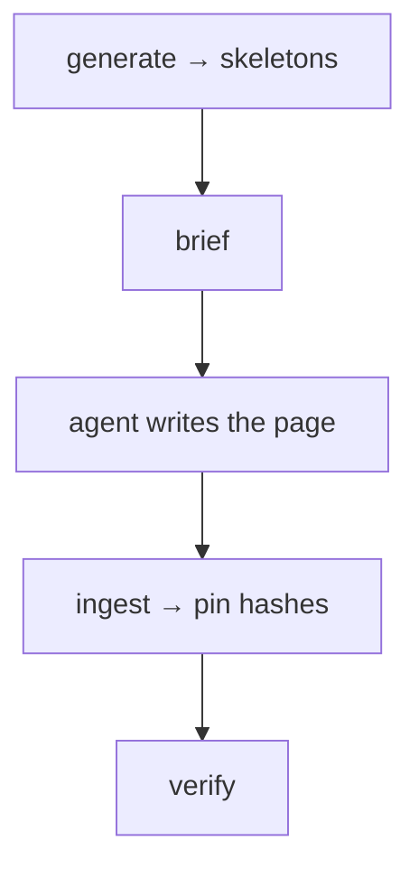

<!-- repo-manual:generated:start -->
# ⑥ CLI

Relevant source files

- [`src/repo_manual/cli.py`](../../../src/repo_manual/cli.py)

**Purpose:** the only system a person touches directly. It's a Typer app whose commands wire the other
systems into the actual workflow — and it's where the **orchestration seam** lives: the tool prepares
work and tracks results, while the agent running it writes the narrative.

## The commands, by where they sit in the loop

| Command | Does | System |
|---|---|---|
| `scan` | analyze → write the structural index | [② Scanning](./scanning.md) |
| `structure` | emit the grouping brief + a suggested `structure.json` | [③ Planning](./planning.md) |
| `generate` | plan + write the manual (systems or package seed) | [③](./planning.md) → [④](./store-freshness.md) |
| `plan` | show pages still needing narrative, and where to ground each | [④](./store-freshness.md) |
| `brief` | print one page's full narration brief | [③](./planning.md) |
| `ingest` | promote orchestrator-filled pages, pin hashes | [④](./store-freshness.md) |
| `stale` | list / `--check`-gate drifted or unwritten pages | [④](./store-freshness.md) |
| `verify` | check every citation resolves | [⑤ Verification](./verification.md) |
| `hook` | print/install the pre-commit drift + citation check | — |
| `serve` | launch the interactive browser viewer | [⑦ Viewer](./viewer.md) |

`Sources: [src/repo_manual/cli.py:62-348]()`

## The orchestration seam

`generate` only ever writes deterministic skeletons — it explicitly refuses a bundled provider, because
the narrative is the *orchestrator's* job. `Sources: [src/repo_manual/cli.py:85-109]()` The agent then
uses `brief` to get a page's complete grounding (files + symbol outline + the recipe rules), writes the
prose into the generated region, and `ingest` pins it. `Sources: [src/repo_manual/cli.py:233-278]()`

## The deterministic gates

Two commands give a non-zero exit so they can guard a commit with **no LLM involved**: `stale --check`
fails when source has drifted from the manual, and `verify` fails on a broken citation. `hook` prints (or
`--install`s) a pre-commit script that runs both. `Sources: [src/repo_manual/cli.py:143-177]()`
`Sources: [src/repo_manual/cli.py:282-303]()`

## How it connects

The **root** of the dependency graph: it imports from [② Scanning](./scanning.md),
[④ Store & Freshness](./store-freshness.md), [⑤ Verification](./verification.md), and the
[⑦ Viewer](./viewer.md), and orchestrates the whole loop. Nothing imports it.
<!-- repo-manual:generated:end -->

<!-- repo-manual:human:start -->
<!-- Human notes for this page are preserved across regeneration. Add yours below. -->
<!-- repo-manual:human:end -->
