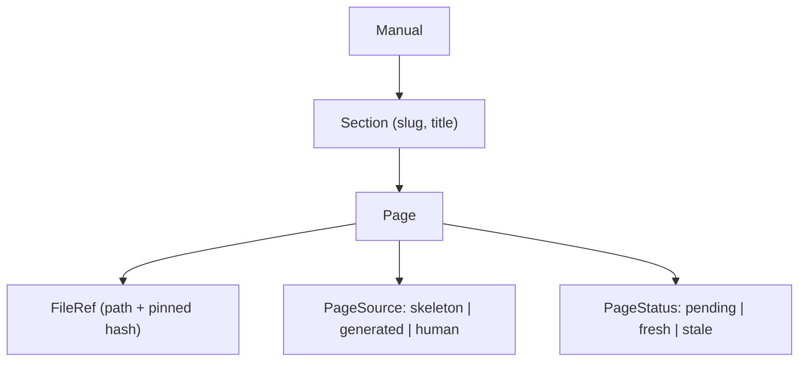

<!-- repo-manual:generated:start -->
# ① Data Model & Config

Relevant source files

- [`src/repo_manual/model.py`](../../../src/repo_manual/model.py) — the in-memory IR
- [`src/repo_manual/config.py`](../../../src/repo_manual/config.py) — the committed settings

**Purpose:** define the words. Every other system imports these dataclasses, so this is the right first
read. There are two halves to the vocabulary — the *structural index* (what we learn from the code) and
the *manual structure* (what we present to the human) — plus the brief that bridges them.

## Half one: the structural index

The index is the deterministic picture of the repo. `Sources: [src/repo_manual/model.py:148-176]()`

- A **`SourceFile`** is one analyzed file, carrying a `content_hash` — the seed of freshness.
  `Sources: [src/repo_manual/model.py:48-71]()`
- A **`Symbol`** is a definition (module / class / function / method), with its qualname, line range,
  signature, and a one-line docstring teaser. `Sources: [src/repo_manual/model.py:75-113]()`
- An **`Edge`** is a relationship — an `IMPORTS` edge between files or a `CALLS` edge between symbols.
  It keeps `resolved` + `dst_name` so an unresolved call is *recorded as unresolved*, never invented.
  `Sources: [src/repo_manual/model.py:117-144]()`
- A **`RepoIndex`** bundles them with two read helpers (`symbols_in`, `internal_imports`) the planner
  leans on. `Sources: [src/repo_manual/model.py:172-176]()`

## Half two: the manual structure

This is what gets written to disk and shown to the reader.

A **`Page`** is one chapter: its title, the `relevant_files` it's grounded in (each a `FileRef` pinned to
the hash it was narrated against), its provenance (`PageSource`) and freshness (`PageStatus`), and a
`body_hash` of its narrated region — which is how `ingest` tells whether the prose was *rewritten* (and so
whether a drifted page should be re-pinned to fresh). `Sources: [src/repo_manual/model.py:221-266]()` A
**`Manual`** is the ordered sections plus the flat page map, with `ordered_pages()` for traversal.
`Sources: [src/repo_manual/model.py:286-311]()`

The provenance/freshness enums are small but load-bearing: `PageSource` distinguishes a deterministic
`SKELETON` from `GENERATED` narrative from hand-written `HUMAN` content (never overwritten), and
`PageStatus` is `PENDING` / `FRESH` / `STALE`. `Sources: [src/repo_manual/model.py:190-202]()`

## The bridge: `GenerationTask`

A **`GenerationTask`** is the self-contained brief the orchestrator needs to narrate one page — the files
to ground in, a symbol outline, and the internal deps — with no hidden state. It's the contract that lets
the LLM be the *orchestrator* rather than a bundled dependency.
`Sources: [src/repo_manual/model.py:320-358]()`

## Robustness + config

Every dataclass round-trips through explicit `to_dict`/`from_dict` (not `dataclasses.asdict`) for stable,
deterministic JSON. One deliberate touch: `_enum_or` parses enum values **tolerantly**, falling back to a
default instead of raising — so an older or hand-edited `.repo-manual` (e.g. a status renamed between
versions) degrades gracefully rather than crashing the load.
`Sources: [src/repo_manual/model.py:20-27]()`

**`ManualConfig`** (`config.py`) is the small committed `manual.config.json`: where the manual lives and
what to scan (`source_dirs`, `excludes`, `include_tests`). Defaults suit a `src/` layout, and `load`/`save`
keep it on disk. `Sources: [src/repo_manual/config.py:28-76]()`

## How it connects

A pure **leaf** — depends on nothing, imported by [② Scanning](./scanning.md) (which fills the index),
[③ Planning](./planning.md) (which builds the manual), and [④ Store & Freshness](./store-freshness.md)
(which persists it).
<!-- repo-manual:generated:end -->

<!-- repo-manual:human:start -->
<!-- Human notes for this page are preserved across regeneration. Add yours below. -->
<!-- repo-manual:human:end -->
