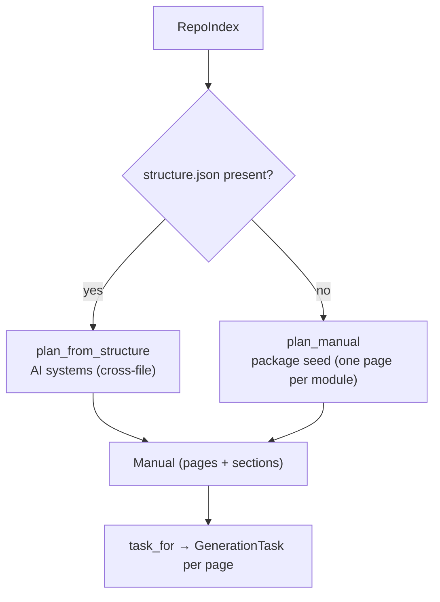

<!-- repo-manual:generated:start -->
# ③ Planning & Grouping

Relevant source files

- [`src/repo_manual/plan.py`](../../../src/repo_manual/plan.py)

**Purpose:** decide *what pages the manual has* — how the repo's files are carved into the chapters a
human reads — and prepare the brief for narrating each one. This is the step that turns a flat file index
into an orientation manual.

## Two grouping modes

- **AI grouping (the real product):** when the orchestrator has authored a `structure.json`,
  `plan_from_structure` builds one page per **system** — a named group of files chosen by *what the code
  does*, which can cross folders. `Sources: [src/repo_manual/plan.py:134-184]()` Files a system names but
  the index doesn't contain are dropped with a warning; files no system claims are swept into an
  `ungrouped` page, so **nothing is silently lost.**
  `Sources: [src/repo_manual/plan.py:164-184]()`
- **Deterministic seed (the no-LLM fallback):** `plan_manual` emits one page per module, grouped into
  sections by package, with a cheap, transparent importance heuristic (entry points & widely-imported
  modules rank high) so the reader gets a sensible order before any LLM is involved.
  `Sources: [src/repo_manual/plan.py:40-88]()` `Sources: [src/repo_manual/plan.py:286-294]()`

`structure_brief` and `suggested_structure` support the handoff: the first emits the file-level grounding
the orchestrator needs to *decide* systems, the second a deterministic package-based starting point to
edit. `Sources: [src/repo_manual/plan.py:187-227]()`

## The brief

For any page, `task_for` assembles the [`GenerationTask`](./data-model.md): the relevant files, a
formatted **symbol outline** (each definition with its signature, line range, and docstring teaser), the
related pages, and the internal deps for the "how it connects" section. This is what the
[⑥ CLI](./cli.md) `brief` command prints and what gets embedded into each skeleton.
`Sources: [src/repo_manual/plan.py:230-251]()`

## How it connects

Consumes the [`RepoIndex`](./scanning.md) and the [model types](./data-model.md); its `Manual` +
`GenerationTask`s are handed to [④ Store & Freshness](./store-freshness.md) to write to disk.
<!-- repo-manual:generated:end -->

<!-- repo-manual:human:start -->
<!-- Human notes for this page are preserved across regeneration. Add yours below. -->
<!-- repo-manual:human:end -->
