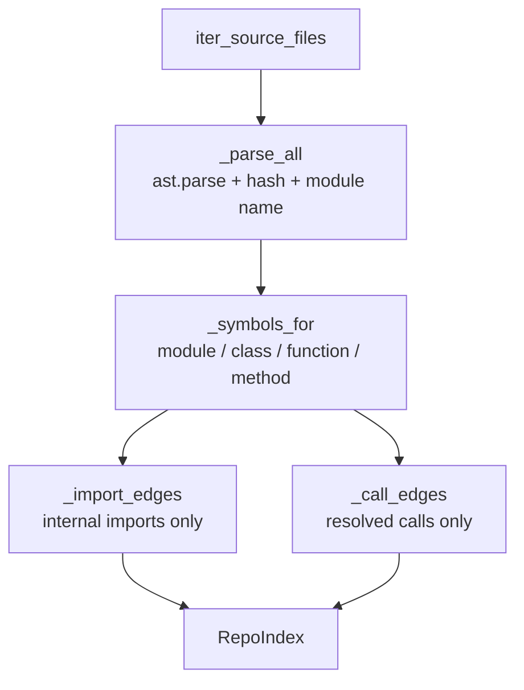

<!-- repo-manual:generated:start -->
# ② Scanning — the grounding

Relevant source files

- [`src/repo_manual/scan/base.py`](../../../src/repo_manual/scan/base.py) — the analyzer protocol + file walk
- [`src/repo_manual/scan/python.py`](../../../src/repo_manual/scan/python.py) — the `ast` analyzer
- [`src/repo_manual/scan/__init__.py`](../../../src/repo_manual/scan/__init__.py) — the package surface
- [`src/repo_manual/hashing.py`](../../../src/repo_manual/hashing.py) — content hashing

**Purpose:** turn source code into a deterministic [`RepoIndex`](./data-model.md). Everything downstream —
the page grouping, the briefs the orchestrator narrates from, the freshness hashes — is built on what this
system extracts. So its defining value is **accuracy: it records only what it can prove, and never
guesses.**

## The pluggable seam

`LanguageAnalyzer` is a `Protocol`: any language implements `analyze(config) -> RepoIndex` and registers
through `get_analyzer`, so adding TypeScript later touches nothing else.
`Sources: [src/repo_manual/scan/base.py:15-22]()` `Sources: [src/repo_manual/scan/base.py:56-62]()`
File discovery is shared: `iter_source_files` walks the `source_dirs`, prunes excluded directories, and
honors the `include_tests` switch — sorted for determinism.
`Sources: [src/repo_manual/scan/base.py:25-46]()`

## The Python analyzer

`PythonAnalyzer.analyze` is a clean two-pass build: parse every file, collect symbols (pass 1), then
resolve edges once every symbol is known (pass 2) — finishing with a stable sort so the index is
byte-identical run to run. `Sources: [src/repo_manual/scan/python.py:39-59]()`

- **Symbols** come from a structured walk of the module body — top-level functions/classes, and methods
  one level into a class — each with a signature (via `ast.unparse`) and a one-line docstring teaser.
  `Sources: [src/repo_manual/scan/python.py:106-140]()`
- **Import edges** are kept only when the imported module maps to a file *in this repo*; relative imports
  are resolved against the importing module's package, and a module path walks up to its nearest indexed
  file. `Sources: [src/repo_manual/scan/python.py:160-200]()`
- **Call edges — the honesty rule.** A call is recorded only when the callee resolves to a symbol we
  actually indexed (a same-file name, or a name bound via `from internal.module import name`). External
  and dynamic calls are **dropped, not guessed**, so the call graph never contains an invented edge.
  `Sources: [src/repo_manual/scan/python.py:204-239]()`

A file that fails to parse still gets indexed (for freshness) with no symbols, rather than breaking the
whole scan. `Sources: [src/repo_manual/scan/python.py:63-89]()`

## Content hashing

`hashing.py` is the tiny primitive underneath freshness: a stable `sha256:<hex>` over file bytes. The
analyzer stamps each `SourceFile.content_hash` here; [④ Freshness](./store-freshness.md) later re-hashes
to detect drift. `Sources: [src/repo_manual/hashing.py:12-21]()`

## How it connects

Produces the [`RepoIndex`](./data-model.md) that [③ Planning](./planning.md) carves into pages. The
"resolved-only" call graph is also what a future blast-radius lens will stand on — which is exactly why it
must never lie.

> ⚠️ **Best-effort, by design.** Instance-method calls (`obj.method()`), attribute dispatch, and
> re-exports aren't resolved — they're omitted rather than approximated. Deepening resolution is the main
> way to strengthen this system, but the bar is: never trade a false edge for coverage.
> `Sources: [src/repo_manual/scan/python.py:273-279]()`
<!-- repo-manual:generated:end -->

<!-- repo-manual:human:start -->
<!-- Human notes for this page are preserved across regeneration. Add yours below. -->
<!-- repo-manual:human:end -->
