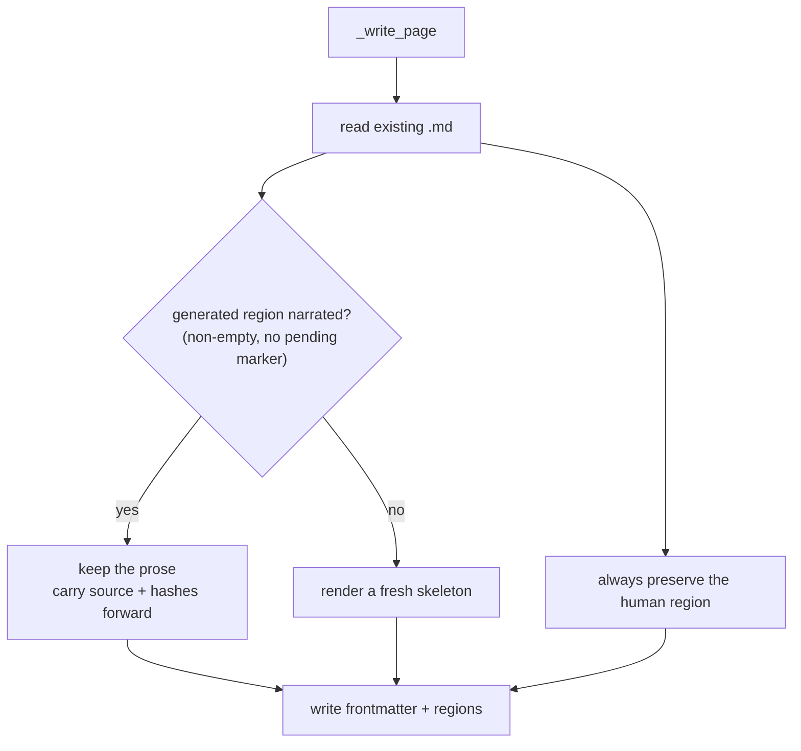

<!-- repo-manual:generated:start -->
# ④ Store & Freshness — the wedge

Relevant source files

- [`src/repo_manual/store.py`](../../../src/repo_manual/store.py) — the `.repo-manual/` writer
- [`src/repo_manual/freshness.py`](../../../src/repo_manual/freshness.py) — drift detection

**Purpose:** own the committed `.repo-manual/` folder — write it, safely re-write it, and know when it's
out of date. This is the **wedge** that separates repo-manual from a served wiki: the manual is a
diffable artifact in the repo, regeneration never destroys narrative or human edits, and a page announces
itself **stale** the moment its source changes.

## The folder is the source of truth

`write_manual` orchestrates a full write: carry provenance forward from the previous manual, write each
page, refresh freshness, then persist `index/*.json`, `manual.json`, and `plan.json`.
`Sources: [src/repo_manual/store.py:109-134]()` The narrative text lives in the `.md` (authoritative);
`manual.json` holds the metadata (authoritative for freshness/provenance).

## The content-preserving merge

This is the careful heart. Each page file has two fenced regions — a **generated** region and a **human**
region — and `_write_page` treats them very differently:

A page that already holds narrative (its generated region is non-empty and lacks the `pending` marker) is
**kept verbatim**; only an un-narrated skeleton is (re)rendered. The human region is *always* carried
over. `Sources: [src/repo_manual/store.py:160-200]()` This is why re-running `generate` reports "N
narratives kept" and never clobbers your work.

`ingest_filled_pages` is the other side of the orchestrator handoff. A page is **(re)pinned** when its
generated region is real (the `pending` marker is gone) **and** either it was a skeleton or its region
changed since the last pin — detected by comparing a `body_hash` of the region. Pinning promotes it to
`GENERATED`, stamps each `relevant_file`'s current hash, and re-syncs the frontmatter. The `body_hash`
check is what lets a **STALE** page return to `FRESH` after you *rewrite* it — while leaving an
un-updated stale page stale. `Sources: [src/repo_manual/store.py:279-309]()`

## Freshness — the drift signal

`freshness.py` is small and decisive. A page is `PENDING` if still a skeleton; otherwise it re-hashes
every `relevant_file` against the working tree — any mismatch (or a deleted file) makes it `STALE`, else
`FRESH`. `Sources: [src/repo_manual/freshness.py:28-35]()` `stale_pages` is what the
[⑥ CLI](./cli.md) `stale`/`plan` commands and the pre-commit hook stand on.
`Sources: [src/repo_manual/freshness.py:48-50]()`

> ⚠️ **Two sources of truth, kept in lockstep.** The `.md` frontmatter mirrors `manual.json`; if a page
> is written before freshness runs they can drift (this caused real bugs). The fix: status is resolved at
> write time and `ingest` re-emits the frontmatter, so the mirror always matches.
> `Sources: [src/repo_manual/store.py:312-325]()`

## How it connects

Consumes the `Manual` + tasks from [③ Planning](./planning.md); its output is checked by
[⑤ Verification](./verification.md) and driven by [⑥ CLI](./cli.md).
<!-- repo-manual:generated:end -->

<!-- repo-manual:human:start -->
<!-- Human notes for this page are preserved across regeneration. Add yours below. -->
<!-- repo-manual:human:end -->
