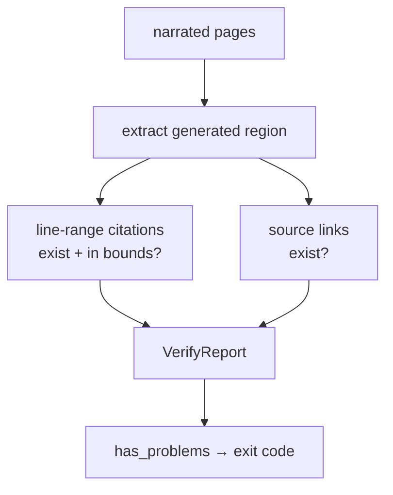

<!-- repo-manual:generated:start -->
# ⑤ Verification — the trust gate

Relevant source files

- [`src/repo_manual/verify.py`](../../../src/repo_manual/verify.py)

**Purpose:** make the narrative *checkable*. The recipe asks the orchestrator to cite every claim to its
source; this system verifies — deterministically, with **no LLM** — that those citations are real. It
exists to catch the one failure mode that sinks AI doc tools: confident prose over fabricated or drifted
line references.

## What it checks

`verify_manual` walks every **narrated** page (skeletons make no claims, so they're skipped), extracts
the generated region, and validates two citation forms:
`Sources: [src/repo_manual/verify.py:62-105]()`

| Form | Shape | Checked |
|---|---|---|
| line-range citation | `Sources: [<file>:<start>-<end>]()` | file exists **and** `1 ≤ start ≤ end ≤ line_count` |
| relative source link | a relative `](…/file.py)` link | the target file exists |

*(The shapes above use placeholders, not live references — a page that documents the citation format
would otherwise fail its own check.)*

Line counts are read straight from the working tree (cached per file), so the check is always against the
*current* source — a citation that pointed at lines a refactor has since shrunk away is caught.
`Sources: [src/repo_manual/verify.py:108-112]()`

## The verdict

Results land in a `VerifyReport` — the citations checked, any `Violation`s, and (under `--strict`) pages
that cite fewer than the minimum number of distinct sources. `has_problems` drives the CLI's exit code,
so `verify` doubles as a CI/pre-commit gate. `Sources: [src/repo_manual/verify.py:39-59]()`

> This page is itself a demonstration: every `Sources:` reference above is checked by the very code it
> describes. When this manual was built, `verify --strict` reported all citations resolving.

## How it connects

Reads the pages written by [④ Store & Freshness](./store-freshness.md); surfaced as the `verify` command
in [⑥ CLI](./cli.md), and paired with `stale --check` in the pre-commit `hook`.
<!-- repo-manual:generated:end -->

<!-- repo-manual:human:start -->
<!-- Human notes for this page are preserved across regeneration. Add yours below. -->
<!-- repo-manual:human:end -->
