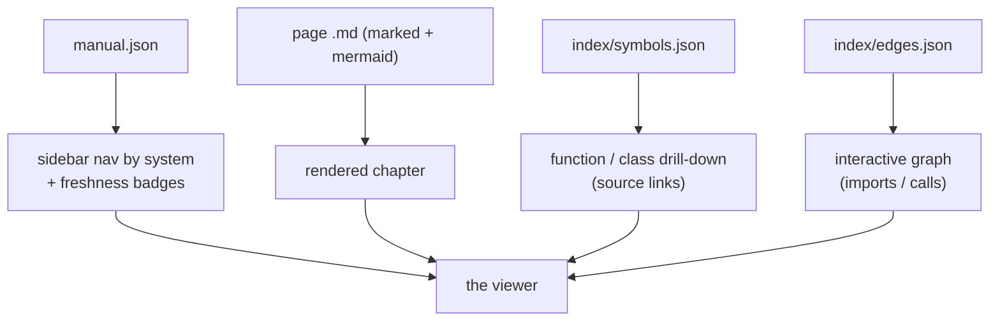

<!-- repo-manual:generated:start -->
# ⑦ Viewer

Relevant source files

- [`src/repo_manual/viewer.py`](../../../src/repo_manual/viewer.py) — the viewer page
- [`src/repo_manual/cli.py`](../../../src/repo_manual/cli.py) — the `serve` command

**Purpose:** make the committed manual *browsable and interactive* without a build step. The whole viewer
is **one static HTML page** held as a string in `viewer.py` and written into `.repo-manual/` by
`write_viewer`. `Sources: [src/repo_manual/viewer.py:20-24]()`

The defining choice: it's a **thin, read-only client over data the tool already emits** — `manual.json`
(nav), `index/symbols.json` (drill-down), `index/edges.json` (the graph), and the page Markdown. Markdown,
Mermaid, and the graph render client-side via CDN libraries, so there's **no Python dependency and no node
toolchain** — and because it's plain HTML/CSS/JS, it's fully customisable.
`Sources: [src/repo_manual/viewer.py:1-16]()`

## Three views, one page

- **Manual view** — a system sidebar (with ✅/⚠️/○ freshness badges), the rendered page with its Mermaid
  diagrams, and a drill-down listing each system's functions/classes (signatures + line ranges + links to
  the real source file).
- **Graph view** — an interactive [cytoscape](https://js.cytoscape.org/) graph in two modes: **imports**
  (file nodes) and **calls** (function nodes), coloured by system. Clicking a node highlights its
  **blast radius** — what it affects (predecessors) versus what it depends on (successors) — and offers an
  "open page" jump back into the manual. The graph reads the same `index/edges.json` the structural index
  produces.

## How it's served

The viewer is launched by the [⑥ CLI](./cli.md) `serve` command, which writes the page and starts a
stdlib `http.server` **rooted at the repo** — so the viewer can fetch its data from `.repo-manual/` and
also link out to the actual source files. `Sources: [src/repo_manual/cli.py:316-348]()`

## How it connects

A pure **consumer**: it reads the committed outputs of [④ Store & Freshness](./store-freshness.md) and the
[② Scanning](./scanning.md) index, and is driven by [⑥ CLI](./cli.md) `serve`. It writes nothing back and
nothing imports it — so it can evolve freely (the planned next step is richer graph interactions) without
touching the core.
<!-- repo-manual:generated:end -->

<!-- repo-manual:human:start -->
<!-- Human notes for this page are preserved across regeneration. Add yours below. -->
<!-- repo-manual:human:end -->
